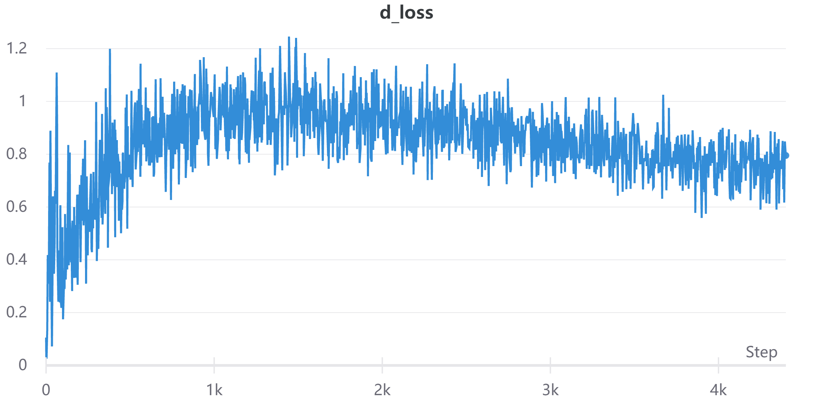
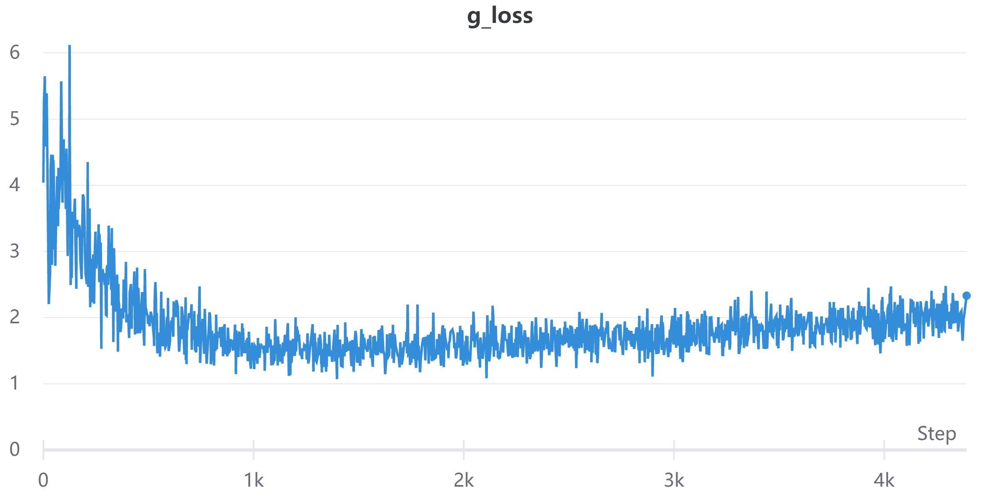
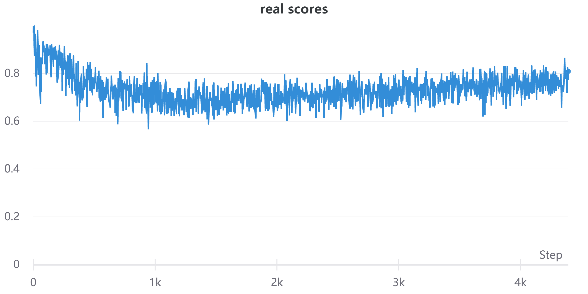
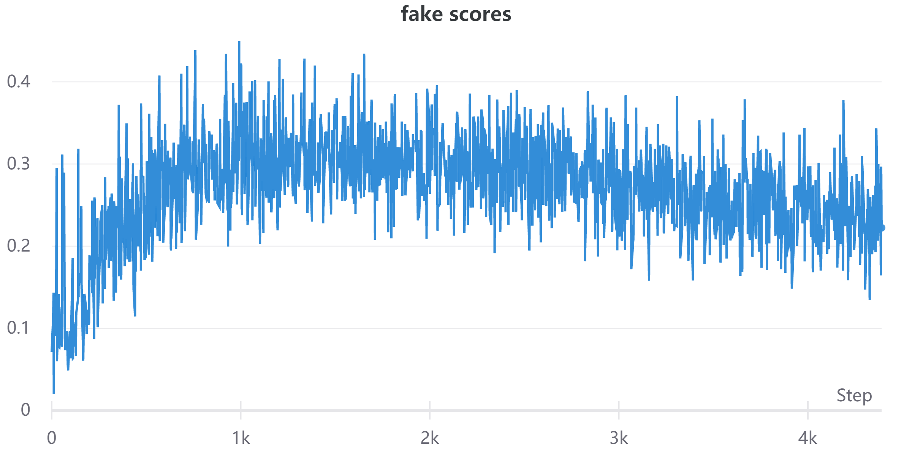
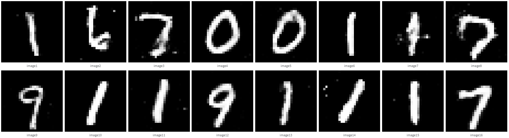

* `conda envs: cfn_dream`

* `Driver Version: 460.32.03`

* `cudatoolkit: 9.0`

* `cudnn: 7.6.5`

* `pytorch: 1.1.0`

* [语雀笔记](https://www.yuque.com/gongliuxingzhui/mak19g/mr1yzu)

```python
# D 表示输入图像属于真实data的概率
# 所以:
#   D(G(z)) -> 0
#   D(x) -> 1
real_label = Variable(torch.ones(img.size(0))).cuda()
fake_label = Variable(torch.zeros(img.size(0))).cuda()
```

* d loss



* g loss



* real score



* fake score



* res

