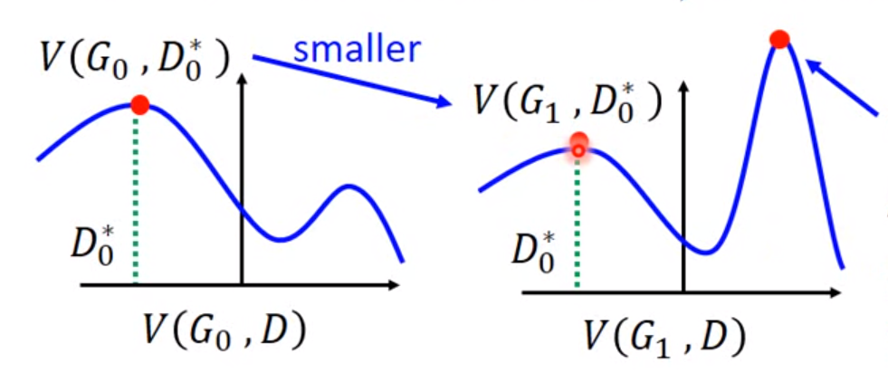
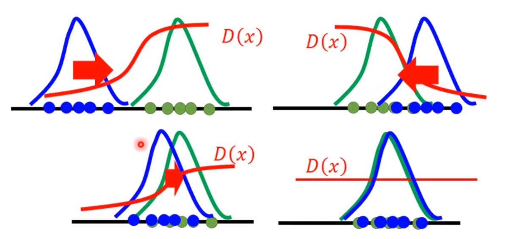

* `conda envs: cfn_dream`

* `Driver Version: 460.32.03`

* `cudatoolkit: 9.0`

* `cudnn: 7.6.5`

* `pytorch: 1.1.0`

* [语雀笔记](https://www.yuque.com/gongliuxingzhui/mak19g/mr1yzu)

```python
# D 表示输入图像属于真实data的概率
# 所以:
#   D(G(z)) -> 0
#   D(x) -> 1
real_label = Variable(torch.ones(img.size(0))).cuda()
fake_label = Variable(torch.zeros(img.size(0))).cuda()
```

* Algorithm

$$
Maximum\ Likelihood\ Estimation (P_{data}, P_{G})\equiv KL\ Divergence (P_{data}, P_{G})\\
\max_{D}V(G,D)=-2\log{2}+2JSD(P_{data}||P_{G})
$$

* Flow

$$
Given\ G_0\\
Find\ D_0^{*}\ maximizing\ V(G_0,D)\\
\theta_G \leftarrow \theta_G - \mu\ \sigma V(G,D_0^*)/\sigma\theta_G\\
Find\ D_1^*\ maximizing\ V(G_1,D)\\
...
$$

* train D：测量JSD

* train G：最小化JSD

* 算法上，训练GAN的时候，$\max_{D}(V,G_D)$一定要得到最好的$D^*$，即训练$k$次$D$；但是G最好变化要小



* 训练过程



* d loss


* g loss


* real score


* fake score


* res

